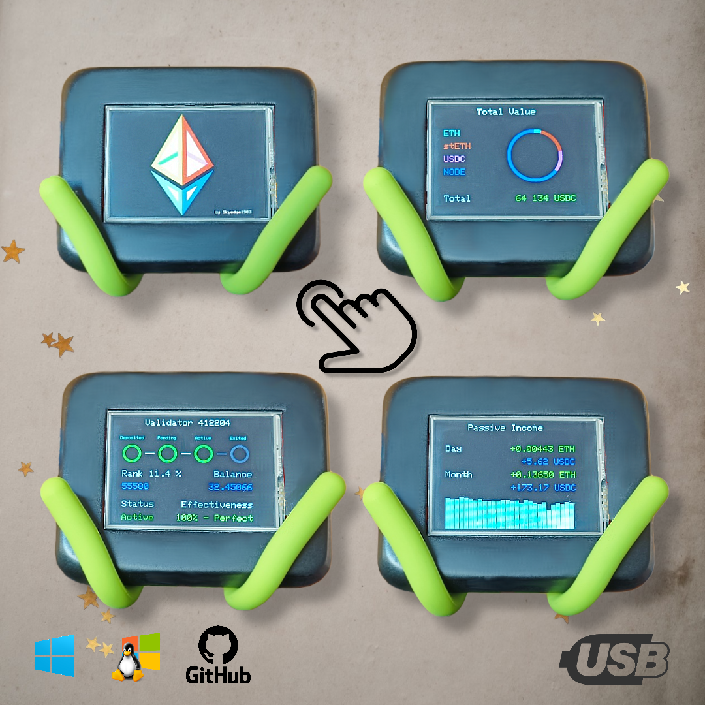

# NodeViewer

## Get the latest version

[Download the latest version](https://github.com/Skyedge1903/NodeViewer/archive/refs/heads/main.zip)
and then Unzip the file in the destination of your choice.
Configure the `configure_me.json` file with your own information.

## Linux Installation

First install python 3.10.0 or higher :
```console
sudo apt-get install python3.10
```

Installation of libraries (with Linux Shell) :

```console
pip install pyserial
pip install requests
```

Then create a file name `launch.sh` (replace with your directories in code) in start-up folder with contain :
```shell
cd ~/NodeViewer/
/usr/bin/python3.10 ticker.py
```

[Launch the script at startup](https://help.ubuntu.com/stable/ubuntu-help/startup-applications.html.en)
for ubuntu. Don't forget to allow the file to run as an application. 
You can then type `~/Bureau/launch.sh` to call the application (replace with your directories).

## Windows Installation

First install [python 3.10.0](https://apps.microsoft.com/store/detail/python-310/9PJPW5LDXLZ5?hl=en-us&gl=us)
or higher on the Windows Store !

Installation of libraries (with Powershell) :

```console
pip install pyserial
pip install requests
```

Then [follow this tutorial to access the start-up folder](https://support.microsoft.com/en-us/windows/add-an-app-to-run-automatically-at-startup-in-windows-10-150da165-dcd9-7230-517b-cf3c295d89dd)
for Windows. Then create a file name `launch.bat` (replace with your directories in code) in start-up folder with contain :

```batch
if not DEFINED IS_MINIMIZED set IS_MINIMIZED=1 && start "" /min "%~dpnx0" %* && exit
	@echo off
	cd C:\Users\%username%\NodeViewer\
	color 0a
	cls
	python3 ticker.py
exit
```

# Arduino

Using the Arduino software, compile and upload the code found in Arduino Sketch/NodeViewer/.
Connect the Arduino to the computer via USB and make sure that the script above is running. If necessary, restart it.

.
The display is the ILI9341.

.
